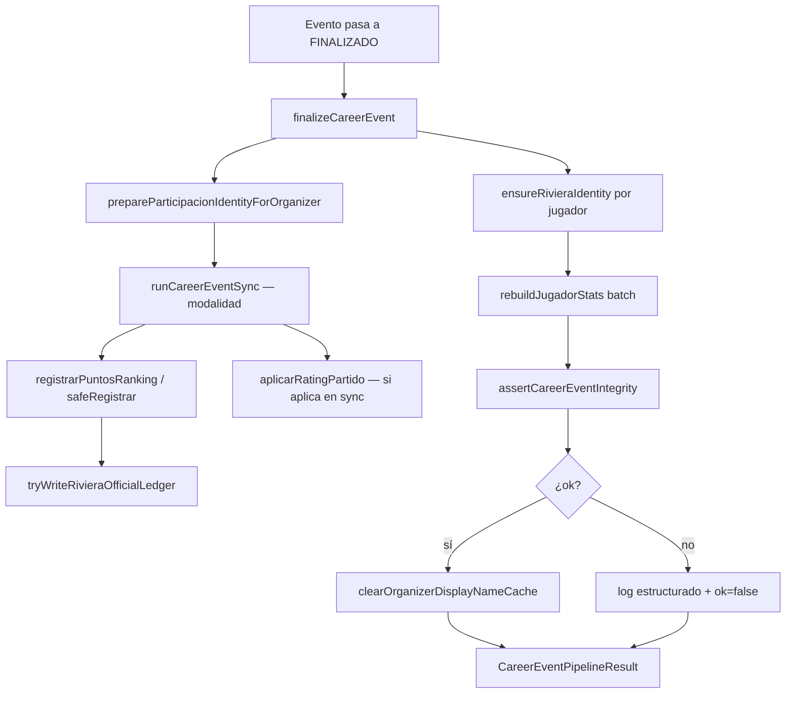

# Career Event Pipeline — Arquitectura definitiva

**Estado:** CANÓNICO — toda modalidad finalizada debe usar este pipeline.

Documento complementario a [`ARCHITECTURE-PLAYER-IDENTITY.md`](./ARCHITECTURE-PLAYER-IDENTITY.md).

---

## Objetivo

Un único flujo para que **cualquier evento finalizado** (Reta, Duelo 2v2, Americano, Torneo Express, Liga, futuras modalidades) actualice de forma consistente:

- Identidad global (Riviera ID)
- Carrera deportiva (historial / participaciones)
- Rating global
- Nivel
- Ranking local
- Puntos globales y por club
- Estadísticas y rachas
- Ledger oficial (ROMC)
- Cachés de vistas públicas/privadas

**No hay lógica paralela por modalidad** para registrar carrera. Las modalidades solo calculan *resultados del evento*; el pipeline ejecuta el post-proceso común.

---

## Fuente canónica de puntos (lectura UI)

Toda pantalla que muestre puntos debe usar:

```typescript
import { resolvePlayerPointsBreakdown } from "@/lib/rivieraJugadores/playerPointsBreakdown";

const breakdown = await resolvePlayerPointsBreakdown({
  jugador,
  identity,                    // opcional si ya resuelto
  currentOrganizadorId: orgId,  // club desde el que se ve
  participaciones,               // opcional si ya cargadas
});
```

### Estructura de salida

```typescript
{
  currentClubPoints: number,      // puntos en el club actual (ranking local)
  globalTotalPoints: number,      // suma todos los clubes
  pointsByClub: [
    { organizador_id, club_name, points }
  ]
}
```

### Club origen vs club actual vs club anfitrión

| Concepto | Significado | Uso |
|----------|-------------|-----|
| **Club origen** | Donde se creó el perfil (`riviera_jugadores.organizador_id`) | Solo branding / etiqueta «Club origen» |
| **Club actual** | `currentOrganizadorId` de la URL / contexto | Ranking local + línea principal en card |
| **Club anfitrión** | `metadata.organizador_id` de la participación | Dónde se jugó el evento — **única fuente para asignar puntos** |

**Nunca** usar club origen para calcular puntos locales si el evento se jugó en otro club.

### Ranking local

- **Orden:** `sortJugadoresByClubLocalPuntos(jugadores, organizadorId)` → `currentClubPoints`
- **Posición:** `rankingPosicionesFromSortedForClub(jugadores, organizadorId)`
- Enriquecimiento previo: `enrichJugadoresOrganizerScopedStats(organizadorId, jugadores)`

### Cards de ranking

Componente: `RankingPtsDisplay` → `buildJugadorPuntosBreakdown` → `breakdownFromCareerResult`

Reglas UI:
- Un solo club con puntos: `HackPadel: 50 pts` (con etiqueta, no número plano)
- Varios clubes: líneas por club + `Total: X pts`
- Cero puntos: `0 pts` sin NaN ni clubes inventados

### Ficha pública/privada

`getPublicPlayerProfileData` → `resolvePlayerPointsBreakdown` → `jugador.pointsBreakdown` + `careerPuntosByClub`

Componente: `JugadorPuntosBreakdown` (misma fuente que ranking card)

### Invariantes de puntos

1. `currentClubPoints` = suma participaciones con `metadata.organizador_id === currentOrganizadorId`
2. `globalTotalPoints` = suma deduplicada de todos los clubes
3. Ranking local y card usan el mismo `currentClubPoints`
4. Historial usa `mergeCareerParticipacionesForIdentity` (sin cambiar)
5. `stats.puntos_totales` es fallback solo si no hay carrera cargada

### Reparación de datos históricos (metadata mal atribuida)

Si participaciones tienen `metadata.organizador_id` del club origen en vez del club anfitrión:

```bash
# 1) Diagnóstico (SQL Editor o CLI)
supabase/diagnose-career-event-host-organizer.sql

# 2) Reparación idempotente (solo metadata.organizador_id + club_name)
supabase/repair-career-event-host-organizer.sql

# 3) Diagnóstico desde app (requiere .env)
npm run diagnose:career-host
```

La reparación resuelve el host desde el evento padre:
- `reta` / `americano` → `tournaments.user_id`
- `duelo_2v2` → `duelos_2v2.organizador_id`
- `torneo_express` → `torneo_express.organizador_id`
- `liga` → `ligas.organizador_id` (vía jornada o liga id)

No modifica puntos, rating, jugadores ni Riviera ID. Tras reparar ejecuta `refresh_jugador_stats` por perfil afectado.

---

```typescript
import { finalizeCareerEvent, processCareerEvent } from "@/lib/rivieraJugadores/careerEventPipeline";

// Alias equivalentes
await finalizeCareerEvent({ kind: "duelo_2v2", organizadorId, duelo });
await processCareerEvent({ kind: "reta", organizadorId, tournament, pairs, matches });
```

### Modalidades registradas

| `kind` | Disparador UI/servicio | Sync interno |
|--------|------------------------|--------------|
| `reta` | `TournamentManager.handleFinishTournament` | `syncRetaParticipaciones` |
| `duelo_2v2` | `duelo2v2Service.finalizarDuelo2v2` | `syncDuelo2v2Participaciones` |
| `americano` | `useAmericanoDinamico` (`phase === "finished"`) | `syncAmericanoParticipaciones` |
| `torneo_express` | `torneoExpressService.finalizarTorneoExpressEliminatoria` | `syncTorneoExpressParticipaciones` |
| `liga_jornada` | `ligaService.finishJornada` | `syncLigaJornada` |
| `liga_podio` | `ligaService.finishLiga` | `syncLigaFinalPodio` |
| `liga_inscripcion` | `ligaService.inscribirJugador` | `syncLigaInscripcionRanking` |

---

## Flujo completo (orden de ejecución)



### Responsabilidades por capa

| Capa | Archivo | Responsabilidad |
|------|---------|-----------------|
| **Pipeline** | `careerEventPipeline/pipeline.ts` | Orquestación, identidad, stats, assertions, caché |
| **Handlers** | `careerEventPipeline/handlers.ts` | Despacho por `kind` → sync |
| **Sync** | `syncParticipaciones.ts` | Agregación por modalidad + `registrarPuntosRanking` |
| **Puntos** | `rivieraRankingPoints.ts` | Fórmulas únicas por `formato` |
| **Rating** | `aplicarRatingPartido.ts` | RPC `aplicar_rating_partido` (idempotente por `partido_ref`) |
| **Identidad lectura** | `playerIdentityService.ts` | Fichas públicas/privadas, carrera fusionada |
| **Identidad escritura** | `careerIdentity.ts` | `ensure_riviera_identity` |
| **Stats / rachas** | `rebuildJugadorStats.ts` | `jugador_stats` desde participaciones |

---

## Invariantes (deben cumplirse siempre)

1. **Un Riviera ID** por carrera deportiva (`official_player_key`).
2. **Un registro de participación** por `(jugador_id, tipo_evento, evento_id, subtipo)` — sin duplicados.
3. **`metadata.organizador_id`** = club donde se jugó (anfitrión), no club origen del perfil.
4. **`metadata.club_name`** presente en toda participación nueva.
5. **Puntos globales** = suma deduplicada de `puntos_obtenidos` en carrera fusionada.
6. **Puntos por club** = filtro por `metadata.organizador_id`.
7. **Rating** idempotente: re-finalizar no duplica movimientos (`partido_ref` único).
8. **Stats** reconstruidas desde participaciones tras cada cierre (pipeline).
9. **Liga interna** (`liga_inscripciones.puntos`) es ranking de temporada; carrera Riviera es `jugador_participaciones`.

---

## Assertions post-finalización

Tras cada `finalizeCareerEvent` (salvo `skipAssertions` en backfill):

| Código | Verificación |
|--------|--------------|
| `missing_historial` | Existe fila en `jugador_participaciones` |
| `missing_rating` | Movimiento en `rating_historial` (si `requireRating`) |
| `missing_local_points` | Puntos coherentes con `puntos_aplicados` |
| `missing_global_points` | Total puntos > 0 (excepto inscripción duplicada) |
| `missing_organizador_id` | `metadata.organizador_id` |
| `missing_club_name` | `metadata.club_name` |
| `missing_riviera_id` | Formato `RIV-########` |
| `missing_player_identity` | Enlace en `riviera_official_player_profile_link` |
| `missing_stats` | Fila en `jugador_stats` |
| `duplicate_participacion` | Sin duplicar subtipo por jugador |
| `sync_failed` | Error en sync de modalidad |

Si `ok === false`, el evento queda marcado en DB como finalizado pero el pipeline registra evidencia en consola (`[career-event-pipeline]`). Los servicios críticos (ej. duelo) loguean `failures` explícitamente.

---

## Puntos de extensión (nueva modalidad)

1. Añadir `CareerEventKind` y entrada en `FinalizeCareerEventInput`.
2. Implementar `syncNuevaModalidadParticipaciones` en `syncParticipaciones.ts`:
   - Usar `resolveJugadorIdForParticipacion`
   - Usar `registrarPuntosRanking` con `hostClubMetadata(organizadorId)`
   - Retornar `CareerEventSyncOutcome`
3. Registrar handler en `handlers.ts`.
4. Llamar `finalizeCareerEvent` desde el servicio al cerrar el evento.
5. Añadir escenario en `careerEventPipeline.e2e.test.ts`.
6. Actualizar esta tabla de modalidades.

**No implementar** inserción directa a `jugador_participaciones`, suma manual de puntos ni `rebuildJugadorStats` fuera del pipeline/sync.

---

## Rating por partido vs por cierre

| Modalidad | Rating en partido | Rating en cierre |
|-----------|-------------------|------------------|
| Reta | Sí (`MatchCardWithResults`) | Sí (batch idempotente) |
| Duelo 2v2 | — | Sí (solo en sync, no en servicio) |
| Americano | Sí (al guardar score) | — |
| Torneo Express | Sí (grupos/eliminatoria) | — |
| Liga | Sí (`updateScore`) | — |

El rating **nunca** se calcula manualmente en UI; siempre `aplicarRatingPartido.ts` → RPC.

---

## Backfill / re-importación

`backfillHistorialJugadores` sigue usando funciones `sync*` directamente con `skipAssertions` implícito (no pasa por pipeline). Tras cada sync ejecuta `refreshJugadorStatsBatch` localmente.

Para re-sincronización masiva en producción, preferir pipeline con:

```typescript
await finalizeCareerEvent({
  kind: "reta",
  ...,
  options: { skipAssertions: true, skipIdentityEnsure: false },
});
```

---

## Perfiles huérfanos (identidad vs carrera)

### Conceptos

| Concepto | Tabla / campo | Rol |
|----------|---------------|-----|
| **Jugador local** | `riviera_jugadores.id` | Perfil operativo de un club |
| **Perfil oficial** | `riviera_jugadores` con `riviera_official_player_profile_link` | Perfil enlazado a carrera global |
| **official_player_key** | `riviera_official_player_identity` | Puente permanente multi-club |
| **Riviera ID** | `riviera_official_player_identity.riviera_id` | Identificador público (RIV-XXXXXXXX) |

### Problema

Participaciones pueden quedar en un `riviera_jugadores` **sin** `riviera_official_player_profile_link` (perfil huérfano). La metadata puede estar correcta, pero `mergeCareerParticipacionesForIdentity()` no fusiona esas filas porque `get_public_career_jugador_ids` solo recorre el grafo oficial.

**Síntoma:** SQL directo muestra puntos; ficha pública muestra 0 en el club anfitrión.

### Detección

```bash
# SQL Editor
supabase/diagnose-orphan-career-profiles.sql
```

### Reparación (solo links HIGH)

```bash
supabase/repair-orphan-career-profile-links.sql
```

- Solo crea `riviera_official_player_profile_link`
- No mueve participaciones ni puntos
- Idempotente

### Prevención (app)

1. `resolveJugadorIdForParticipacion` → `ensureRivieraIdentity` + `requireOfficialProfileLinkForParticipacion` (lanza si REVIEW/LOW)
2. `validateCareerEventPreClose` antes de sync (padre + integridad por jugador)
3. `assertCareerEventIntegrity` post-sync

**HIGH estricto:** solo `grant_*`, `same_legacy`, `host_club_overlap`. `cross_club_profile` solo → **REVIEW** (sin auto-link).

Histórico Daniel/Sebastian (solo cross-club): reparar con SQL manual tras revisión admin, no auto-link en runtime.

### Auditoría continua

```bash
npm run audit:career-integrity
npm run verify:career-integrity   # pre-deploy obligatorio
```

Ver [`CAREER-INTEGRITY-AUDIT.md`](./CAREER-INTEGRITY-AUDIT.md).

---

## Checklist de validación (pre-merge / post-deploy)

- [ ] `npm run verify:career-integrity` pasa
- [ ] `diagnose-orphan-career-profiles.sql` → 0 HIGH pendientes
- [ ] Finalizar duelo en HackPadel: 50 pts, `club_name` correcto
- [ ] Ficha pública: historial fusionado multi-club sin duplicados
- [ ] Re-importar jugador cedido: misma identidad, historial intacto
- [ ] Quitar de club: sin pérdida de carrera global
- [ ] Torneo Express cerrado: stats refrescadas (antes gap)
- [ ] Liga podio: stats refrescadas (antes gap)

---

## Archivos clave

```
src/lib/rivieraJugadores/
  careerEventPipeline/
    index.ts
    pipeline.ts          ← finalizeCareerEvent / processCareerEvent
    handlers.ts
    assertions.ts
    types.ts
    careerEventPipeline.e2e.test.ts
  syncParticipaciones.ts ← agregación por modalidad (única)
  aplicarRatingPartido.ts
  rivieraRankingPoints.ts
  rebuildJugadorStats.ts
  playerIdentityService.ts
```

---

## Auditoría — lógica que NO debe duplicarse

| Prohibido fuera de sync/pipeline | Ubicación canónica |
|----------------------------------|-------------------|
| Insertar participaciones | `registrarParticipacion` / `safeRegistrar` |
| Calcular puntos ranking | `calcularPuntosEventoDesglose` |
| Aplicar rating | `aplicarRatingPartido` |
| Rebuild stats | `rebuildJugadorStats` (vía pipeline) |
| Resolver identidad en lectura | `PlayerIdentityService` |
| Asegurar Riviera ID | `ensureRivieraIdentity` (vía pipeline) |
| Enlazar perfil huérfano | `ensureOfficialProfileLinkForParticipacion` |
| Detectar/reparar huérfanos | SQL `diagnose/repair-orphan-career-profile-links` |

`MatchResultCalculator.accumulateMatchStatistics` es **solo UI** — no persiste.

---

## Tests

```bash
npm run test:career-pipeline
npm run test:career-integrity
```

Incluye:

1. Pipeline duelo 2v2 con assertions OK
2. Pipeline con fallo `missing_historial`
3. Escenario E2E multi-club: Club Test + HackPadel + Riviera Open
4. Puntos por club / total global / sin duplicados en reimportación
